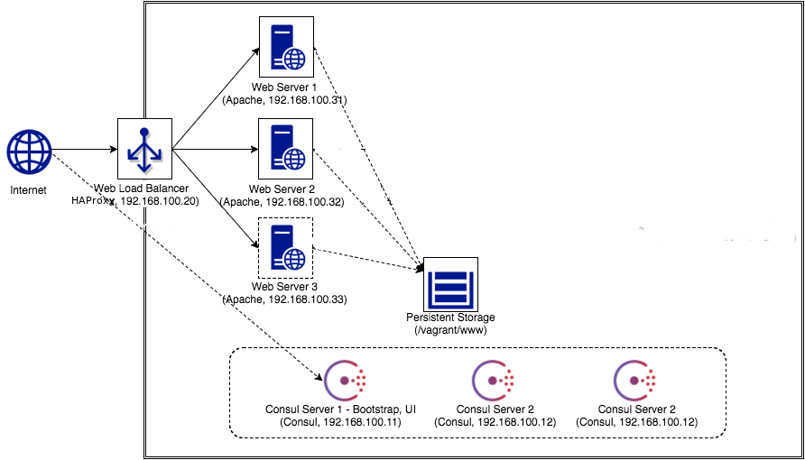
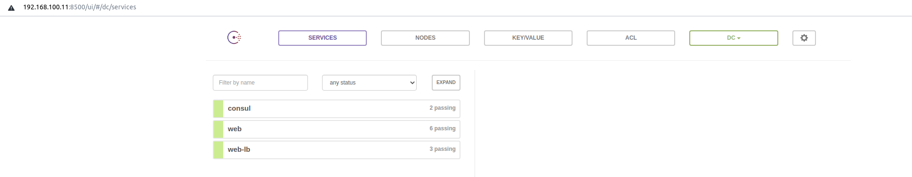
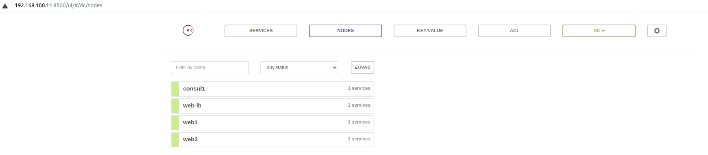
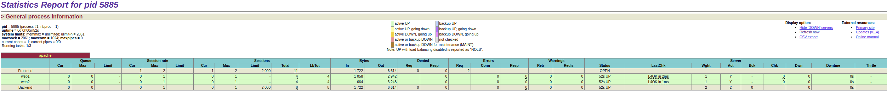

## Vagrant: HAProxy + Consul + Consul Template (scalable web application example)

- Vagrant for launching multiple VM instances and persistent storage
- Consul for health checking and service discovery
- Consul Template for automated load balancer management
- HAProxy for  HTTP server load balancing (or TCP : MySQL/etc. service LB)



### Prerequisites
- Vagrant: http://www.vagrantup.com/
- VirtualBox: https://www.virtualbox.org/

### Usage
```
 $ vagrant up
 $ vagrant status
Current machine states:

consulserver1.local       running (virtualbox)
web-lb.local              running (virtualbox)
web1.local                running (virtualbox)
web2.local                running (virtualbox)
 
```   

The Vagrant contains:

- 3 x Consul servers
- 3 x Apache web servers
- 1 x HAProxy load balancer

Note: In order to reduce the launching time, 2 x Consul servers are commented as single Consul server will still work well. Consul recommends to launch at least 3 x Consul servers to prevent single point of failures. In addition, 1 x Apache web server is commented to not launch initially.If you would like to test completed architectures, then uncomment VM definitions.

Following list depicts detailed environment configurations for each VM:
* Consul servers
    * Consul 1 - Bootstrap, Web UI
        * Private IP: 192.168.100.11
        * Hostname: consulserver1.local
        * Web UI access URL: [http://192.168.100.11:8500](http://192.168.100.11:8500)
    * Consul 2 
        * Private IP: 192.168.100.12
        * Hostname: consulserver2.local
        * Commented to not launch in initial checkout
    * Consul 3
        * Private IP: 192.168.100.13
        * Hostname: consulserver3.local
        * Commented to not launch in initial checkout
* Web server load balancer
    * Private IP: 192.168.100.20
    * Hostname: web-lb.local
    * Web Access URL: [http://192.168.100.20:80](http://192.168.100.20)
    * Configured with Consul Template and HAProxy
    * This instance will be access point for internet users.
* Web servers
    * Web server 1 
        * Private IP: 192.168.100.31
        * Hostname: web1.local
        * Configured with Apache web server
        * When the instance is launched, then Consul Template in Web server load balancer will generate new nginx config file.
    * Web server 2
        * Private IP: 192.168.100.32
        * Hostname: web2.local
        * Same as Web server 1
        * Commented to not launch in initial checkout
    * Web server 3
        * Private IP: 192.168.100.33
        * Hostname: web3.local
        * Same as Web server 1
        * Commented to not launch in initial checkout


After vagrant machines are running, you can connect instances to:

Consul WEB UI: 192.168.100.11:8500
Web Load Balancing Machine: 192.168.100.20

If having the error message 'The guest additions on this VM do not match the install version of VirtualBox!', then run following command before vagrant up
```
$ vagrant plugin install vagrant-vbguest
```

### Features
- Launch scalable architecture in single command
- Used Consul to manage server nodes, service discovery and health checking
- Configured web server load balancing with Consul Template + HAProxy

Once all vagrant instances up, you can access Consul Web UI by opening browser http://192.168.100.11:8500. Then you will see services like consul, web-lb, web. In Nodes section, you will see nodes like consul1, web-lb, web1 and so on. If you see services and nodes as following screenshot, then it is successfully up and running.




HAProxy: Open browser and access to http://192.168.100.20.




